# Q-Ways
## Quantum-Inspired Intelligent Traffic Route Optimization in Transportation Systems Using Metaheuristic Optimization

**Smart India Hackathon 2026 — Problem Statement: SIH26137**

Q-Ways is a traffic-aware multi-vehicle route optimization platform that models an urban road network as a weighted graph and uses **Quantum-behaved Particle Swarm Optimization (QPSO)** to search for efficient delivery/transport routes.

The system combines:

- Real road-network data from **OpenStreetMap**
- **OSMnx + NetworkX** graph construction
- Dynamic/simulated traffic weights
- Shortest-path computation using **Dijkstra**
- Distance and travel-time matrices
- **QPSO** metaheuristic optimization
- Vehicle capacity and customer-demand handling
- Delivery time-window penalties
- Interactive **Leaflet/OpenStreetMap** route visualization
- React + TypeScript frontend
- FastAPI backend
- Benchmarking and convergence analysis

---

## 1. Problem Statement

Urban transportation networks are dynamic. A route that is short under free-flow conditions may become inefficient when congestion, delivery demand, vehicle capacity, and time constraints are considered together.

Q-Ways models the transportation network as a weighted graph:

- **Vertices** represent the depot, delivery/customer locations, or road intersections.
- **Edges** represent road segments.
- Edge weights represent travel time and distance.
- Traffic conditions dynamically modify travel time.
- Multiple vehicles are routed from and back to a central depot.
- Vehicle capacity, demand, and delivery deadlines are included in the optimization cost.

The objective is to find a low-cost set of vehicle routes while accounting for:

1. Travel time
2. Road distance
3. Traffic congestion
4. Vehicle capacity
5. Number of available vehicles
6. Delivery time windows

---

# 2. Solution Overview

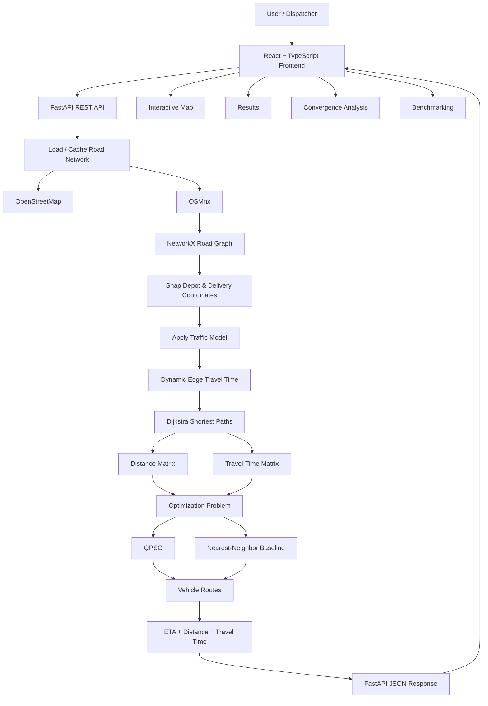

---

# 3. System Architecture

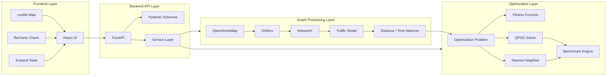

---

# 4. End-to-End Workflow

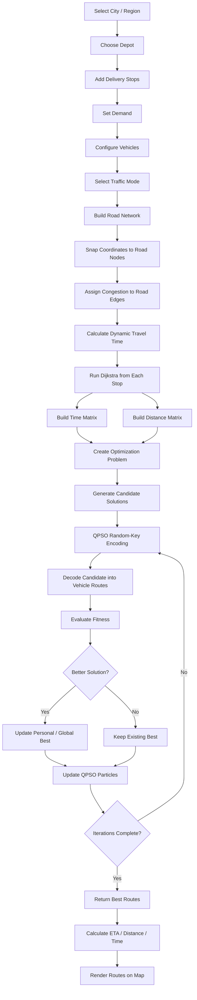

---

# 5. Core Technology Stack

| Layer | Technology | Purpose |
|---|---|---|
| Frontend | React 19 | Component-based UI |
| Language | TypeScript | Type-safe frontend development |
| Build Tool | Vite | Frontend development and production build |
| Styling | Tailwind CSS | UI styling |
| State Management | Zustand | Optimizer and application state |
| Routing | React Router | Multi-page SPA navigation |
| Maps | Leaflet | Interactive map rendering |
| Map Data | OpenStreetMap | Road-map tiles and geographic data |
| Charts | Recharts | Convergence and scalability visualizations |
| Icons | Lucide React | UI icons |
| Math Rendering | KaTeX | Mathematical formulation display |
| Backend | FastAPI | REST API |
| Backend Server | Uvicorn | ASGI application server |
| Validation | Pydantic | API request/response schemas |
| Graph Processing | NetworkX | Road graph and shortest paths |
| Road Data | OSMnx | OpenStreetMap road-network extraction |
| Numerical Computing | NumPy | Matrices and numerical operations |
| Optimization | QPSO | Quantum-inspired metaheuristic routing |
| Baseline | Nearest Neighbor | Greedy routing baseline |
| Road Routing | Dijkstra | Fastest path between graph nodes |
| Geometry | OSRM API | Road geometry for frontend route rendering |
| Data Cache | GraphML | Local cached road graph |
| Code Quality | Oxlint | Frontend linting |

---

# 6. Important Clarification About "Quantum-Inspired"

Q-Ways does **not** require a quantum computer or quantum hardware.

The optimization engine is a classical implementation of **Quantum-behaved Particle Swarm Optimization (QPSO)**.

QPSO keeps the quantum-inspired search behavior mathematically, while all computation runs on a conventional CPU using Python and NumPy.

The implementation uses continuous particle positions and converts them into discrete vehicle visit orders using **random-key encoding**.

---

# 7. Road Network Construction

The backend obtains a drivable urban road network from OpenStreetMap using OSMnx.

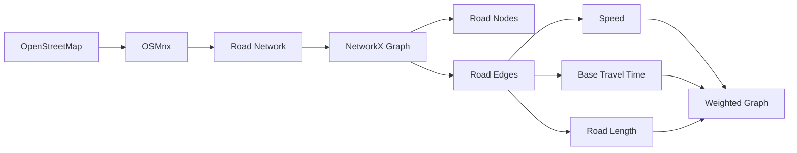

Each road network is represented as:

```text
G = (V, E)
```

where:

- `V` = road/intersection nodes
- `E` = road segments

The graph is saved as `city.graphml` after the first download and reused on later runs.

---

# 8. Coordinate Snapping

User-provided latitude/longitude coordinates are not necessarily located exactly on graph nodes.

Q-Ways therefore snaps every depot and delivery coordinate to the nearest road node.

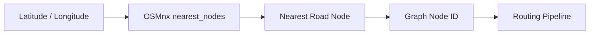

This ensures that optimization operates on valid road-network locations.

---

# 9. Traffic Modeling

The prototype supports simulated traffic conditions.

Each road receives a congestion value:

```text
c ∈ [0, 1]
```

Dynamic travel time is calculated as:

```text
dynamic_time = base_travel_time × (1 + γ × congestion)
```

where:

- `base_travel_time` = OSM-derived travel time
- `congestion` = simulated congestion value
- `γ` = congestion sensitivity coefficient

The implementation currently supports:

- Normal traffic
- Rush traffic
- Auto mode based on time of day
- Traffic updates with random congestion drift
- Incident spikes

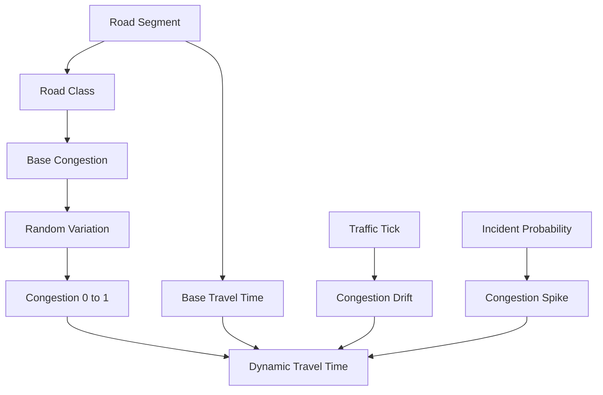

The traffic implementation is **simulated**, not a live external traffic feed.

---

# 10. Shortest-Path and Matrix Generation

Once traffic has been applied, NetworkX Dijkstra is used to calculate fastest paths.

For every selected depot/delivery node:

```text
time_matrix[i][j]
```

stores the fastest travel time from stop `i` to stop `j`.

Similarly:

```text
dist_matrix[i][j]
```

stores the road distance of that fastest path.

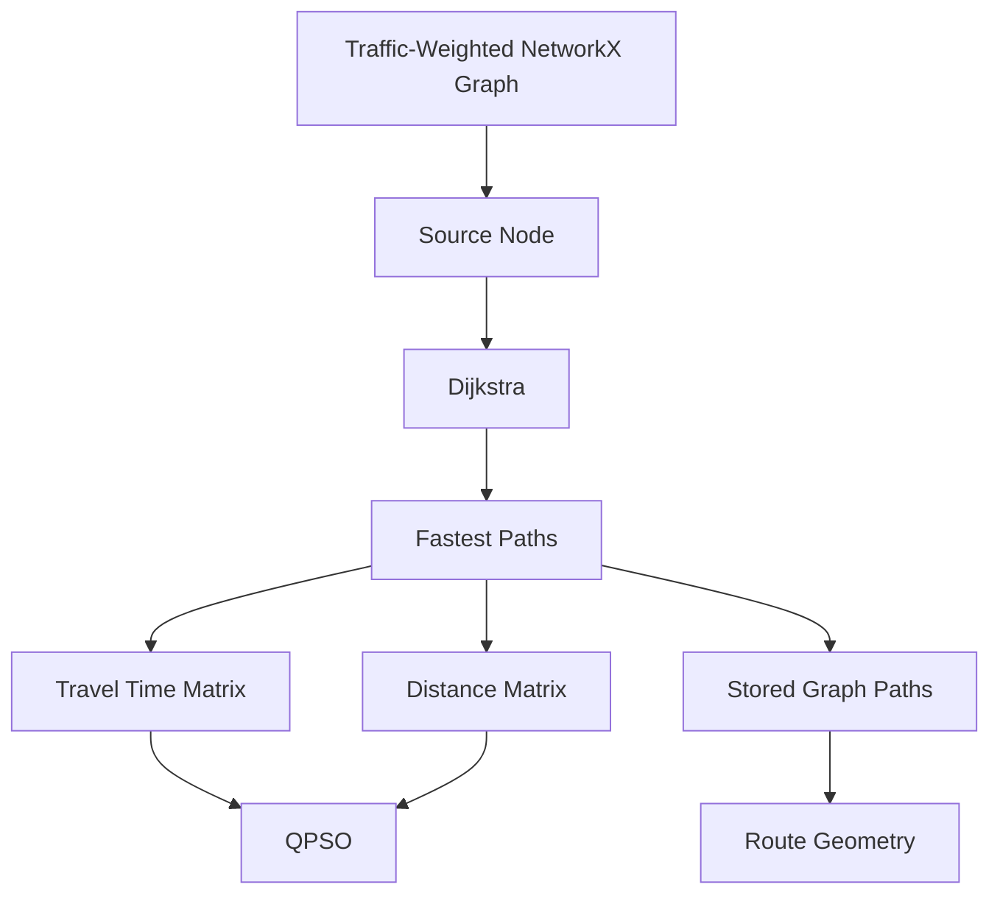

This separates expensive graph routing from the optimization loop.

The optimizer therefore performs fast matrix lookups instead of repeatedly running graph searches.

---

# 11. Vehicle Routing Model

Q-Ways handles a multi-vehicle routing problem with:

- Central depot
- Multiple delivery stops
- Customer demand
- Multiple vehicle capacities
- Optional delivery deadlines
- Traffic-dependent travel time
- Return-to-depot routes

A route has the general structure:

```text
Depot → Stop 1 → Stop 2 → ... → Stop N → Depot
```

Multiple vehicles produce:

```text
Vehicle 1: Depot → A → C → B → Depot
Vehicle 2: Depot → D → E → Depot
Vehicle 3: Depot → F → Depot
```

---

# 12. QPSO Optimization

The QPSO implementation uses **random-key encoding** because QPSO operates on continuous particle positions while vehicle routing is a discrete permutation problem.

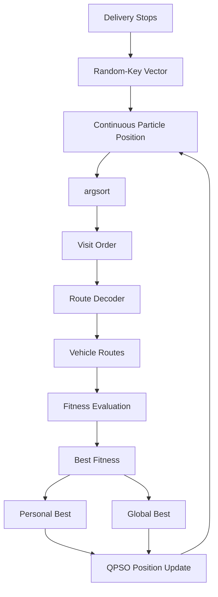

For example:

```text
Particle:
[0.71, 0.12, 0.83, 0.35]

argsort:
[2, 4, 1, 3]

Visit order:
Stop 2 → Stop 4 → Stop 1 → Stop 3
```

The resulting order is decoded into vehicle routes according to vehicle capacities.

---

# 13. QPSO Update Mechanism

The implementation maintains:

- Particle positions
- Personal best positions
- Global best position
- Mean personal-best position
- Contraction-expansion coefficient `β`

The coefficient changes from exploration toward exploitation:

```text
β_start = 1.0
β_end   = 0.4
```

The particle update uses:

```text
p = φ × pbest + (1 - φ) × gbest
```

followed by the QPSO position update:

```text
x(t+1) =
p ± β |mbest - x(t)| ln(1/u)
```

where:

- `x` = particle position
- `pbest` = personal best
- `gbest` = global best
- `mbest` = mean personal-best position
- `β` = contraction-expansion coefficient
- `φ` = random value in `[0,1]`
- `u` = random value in `(0,1]`

---

# 14. Fitness Function

The optimization engine minimizes a cost consisting of travel time and penalties.

The implemented fitness function is:

```text
Fitness =
    Total Travel Time
    + Time-Window Penalty
    + Unreachable-Edge Penalty
    + Capacity/Fleet Penalties
```

The time-window penalty is:

```text
Penalty =
    50 × late_minutes
```

for each late stop.

Capacity and fleet-size violations are also penalized during QPSO route decoding.

### Penalty constants in the implementation

| Penalty | Value |
|---|---:|
| Time-window penalty | `50` per late minute |
| Capacity violation | `1,000,000` per unit overflow |
| Extra vehicle | `10,000,000` per additional vehicle |
| Unreachable route | `1,000,000,000` edge threshold |

The penalties are soft constraints: violations increase cost rather than automatically deleting a candidate solution.

---

# 15. Route Decoding

QPSO produces a single delivery ordering. The decoder divides that ordering across vehicles.

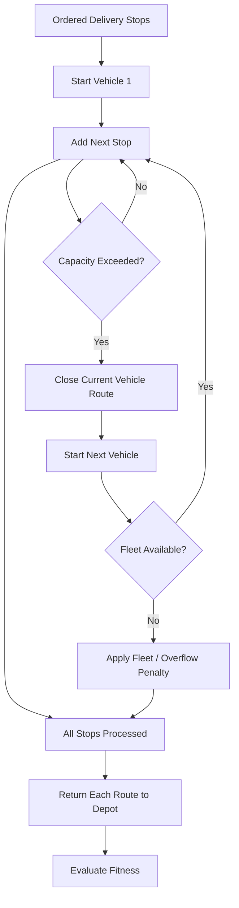

---

# 16. ETA and Time-Window Processing

For every generated route, Q-Ways calculates cumulative arrival time.

```text
ETA(stop i) =
Σ travel_time of all route segments before stop i
```

For a deadline `b_i`:

```text
lateness = max(0, ETA_i - b_i)
```

The frontend can therefore display:

- Expected arrival
- Actual arrival
- Deadline
- Lateness

---

# 17. Backend API Flow

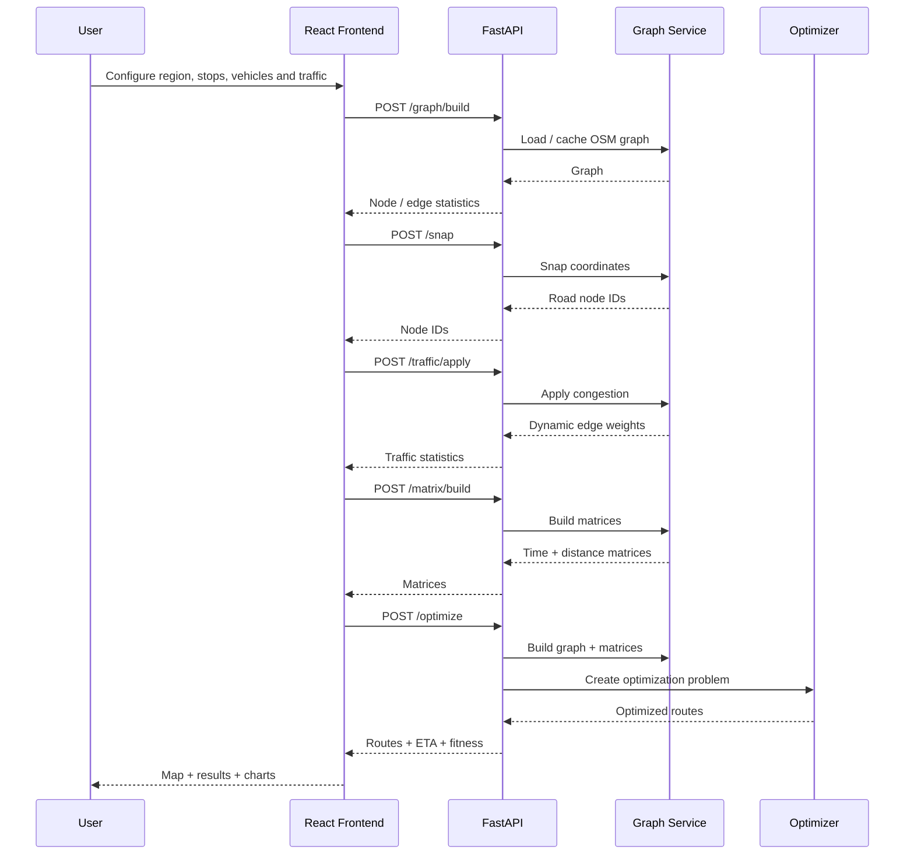

---

# 18. Backend Endpoints

| Method | Endpoint | Purpose |
|---|---|---|
| `GET` | `/health` | Backend health check |
| `POST` | `/graph/build` | Load/download and cache road network |
| `POST` | `/snap` | Convert coordinates to road-node IDs |
| `POST` | `/traffic/apply` | Apply simulated congestion |
| `POST` | `/matrix/build` | Generate travel-time and distance matrices |
| `POST` | `/optimize` | Run routing optimization |
| `POST` | `/compare` | Run optimization benchmark |

FastAPI automatically exposes interactive API documentation at:

```text
http://127.0.0.1:8000/docs
```

---

# 19. Frontend Architecture

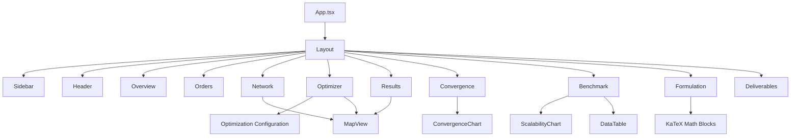

---

# 20. Frontend Features

### Overview
Project introduction, workflow, and system explanation.

### Orders
Interface for configuring bulk delivery/order data.

### Network
Interactive graph/network representation with road nodes, edges, traffic levels, and depot information.

### Optimizer
Configuration of:

- Geographic area
- Depot/user location
- Traffic mode
- Number of vehicles
- Vehicle capacity
- Swarm parameters
- Iteration count
- QPSO parameters

### Results
Displays optimized vehicle routes and route statistics.

### Convergence
Displays optimization fitness progression over iterations.

### Benchmark
Provides benchmark tables and scalability visualization.

### Formulation
Displays the mathematical routing formulation using KaTeX.

### Deliverables
Maps the technical implementation to the project deliverables.

---

# 21. Interactive Map

The frontend uses **Leaflet** with OpenStreetMap tiles.

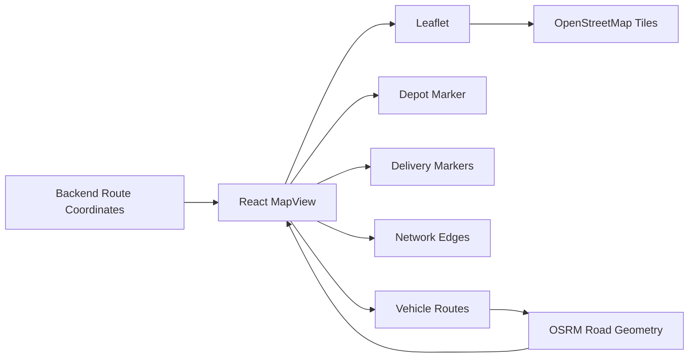

The map supports:

- Depot visualization
- Delivery-stop markers
- Network edges
- Traffic-level visualization
- Vehicle-specific routes
- Route tooltips
- Node selection
- Edge selection
- Road snapping
- Road geometry retrieval through OSRM

---

# 22. Data Model

## Graph Node

```text
GraphNode
├── id
├── name
├── latitude
├── longitude
├── demand
├── isDepot
└── timeWindow
```

## Graph Edge

```text
GraphEdge
├── id
├── source
├── target
├── distanceKm
├── baseTimeMin
├── trafficLevel
└── congestionFactor
```

## Vehicle Route

```text
VehicleRoute
├── vehicleId
├── nodeIds
├── stops
├── coordinates
├── distanceKm
├── timeMin
├── load
└── capacity
```

---

# 23. Data Flow

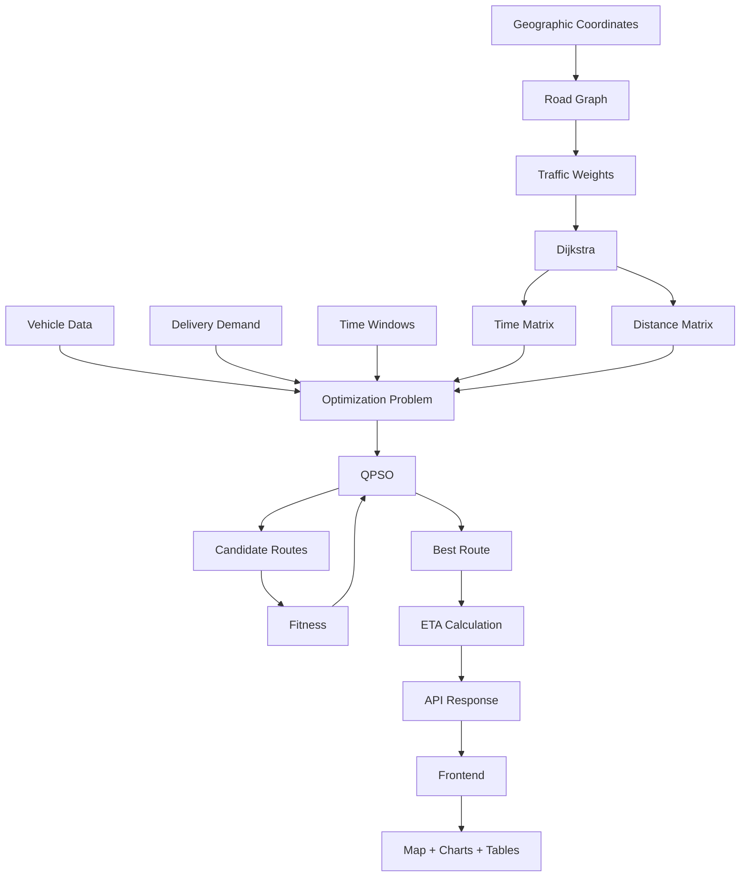

---

# 24. Benchmarking

The backend contains a comparison framework for repeated optimization runs.

The benchmark infrastructure records values such as:

- Best cost
- Average cost
- Standard deviation
- Runtime
- Iterations to convergence

The frontend also contains support for comparing:

```text
QPSO
PSO
GA
ACO
Dijkstra
OR-Tools
```

The repository's actual optimization implementation is centered on **QPSO and the nearest-neighbor baseline**. The comparison UI/schema provides the structure for broader algorithm comparison.

---

# 25. Convergence Analysis

Q-Ways stores:

```text
fitness_history
```

during QPSO execution.

This allows the frontend to plot:

```text
Best Fitness
     │
     │\
     │ \
     │  \____
     │       \____
     │            \____
     └──────────────────── Iterations
```

The purpose is to visualize how the global best solution changes during the optimization process.

---

# 26. Repository Structure

```text
Q-Ways/
│
├── QPSO_Backend/
│   ├── main.py
│   ├── main (2).py
│   ├── requirements.txt
│   ├── city.graphml
│   │
│   ├── graph/
│   │   ├── road_network.py
│   │   ├── distance_matrix.py
│   │   ├── route_geometry.py
│   │   └── traffic.py
│   │
│   ├── optimization/
│   │   ├── problem.py
│   │   ├── fitness.py
│   │   ├── qpso.py
│   │   └── compare.py
│   │
│   ├── schemas/
│   │   └── optimization.py
│   │
│   └── services/
│       ├── graph_service.py
│       └── optimization_service.py
│
└── QPSO_Frontend/
    ├── package.json
    ├── vite.config / Vite configuration
    ├── index.html
    │
    └── src/
        ├── App.tsx
        ├── main.tsx
        ├── api/
        ├── assets/
        ├── components/
        │   ├── charts/
        │   ├── common/
        │   ├── layout/
        │   ├── map/
        │   └── optimizer/
        │
        ├── lib/
        └── pages/
            ├── Overview.tsx
            ├── BulkOrders.tsx
            ├── Network.tsx
            ├── Optimizer.tsx
            ├── Results.tsx
            ├── Convergence.tsx
            ├── Benchmark.tsx
            ├── Formulation.tsx
            └── Deliverables.tsx
```

---

# 27. Backend Module Responsibilities

| Module | Responsibility |
|---|---|
| `main.py` | FastAPI application and REST endpoints |
| `road_network.py` | OSM road-network download, caching, and coordinate snapping |
| `traffic.py` | Simulated congestion and dynamic travel-time calculation |
| `distance_matrix.py` | Dijkstra-based time/distance matrices |
| `route_geometry.py` | Converts graph paths to geographic coordinates |
| `graph_service.py` | Central graph state and graph-processing pipeline |
| `problem.py` | Standardized optimization problem representation |
| `fitness.py` | Shared route-cost and penalty calculations |
| `qpso.py` | QPSO particle initialization, updates, decoding, and optimization |
| `compare.py` | Repeated benchmark execution |
| `optimization_service.py` | Solver orchestration and API response generation |
| `schemas/optimization.py` | Pydantic request/response models |

---

# 28. Frontend Module Responsibilities

| Module | Responsibility |
|---|---|
| `App.tsx` | Application routing |
| `api/client.ts` | Backend communication |
| `api/types.ts` | Frontend data models |
| `components/map/` | Leaflet map and map legend |
| `components/charts/` | Convergence and scalability charts |
| `components/optimizer/` | Optimization configuration UI |
| `components/common/` | Reusable UI components |
| `components/layout/` | Header, sidebar, and layout |
| `pages/Optimizer.tsx` | Optimization workflow |
| `pages/Results.tsx` | Route result visualization |
| `pages/Benchmark.tsx` | Benchmarking interface |
| `pages/Convergence.tsx` | Convergence visualization |
| `pages/Formulation.tsx` | Mathematical formulation |
| `pages/Network.tsx` | Network visualization |
| `pages/BulkOrders.tsx` | Order input |
| `pages/Deliverables.tsx` | Deliverable mapping |

---

# 29. Installation

## Prerequisites

Install:

- Python 3.10+
- Node.js
- npm
- Git
- Internet connection for the first OpenStreetMap road-network download

---

## Backend Setup

```bash
cd QPSO_Backend
```

Create a virtual environment:

### Windows

```bash
python -m venv venv
venv\Scripts\activate
```

### Linux / macOS

```bash
python3 -m venv venv
source venv/bin/activate
```

Install dependencies:

```bash
pip install -r requirements.txt
```

Start FastAPI:

```bash
uvicorn main:app --reload
```

Backend:

```text
http://127.0.0.1:8000
```

Swagger API documentation:

```text
http://127.0.0.1:8000/docs
```

---

# 30. Frontend Setup

Open another terminal:

```bash
cd QPSO_Frontend
```

Install dependencies:

```bash
npm install
```

Start Vite:

```bash
npm run dev
```

The frontend will normally be available at the local URL displayed by Vite.

---

# 31. Environment Configuration

The frontend API client uses:

```text
VITE_API_URL
```

If it is not provided, the client defaults to:

```text
http://localhost:8000
```

Example:

```text
VITE_API_URL=http://localhost:8000
```

---

# 32. Running the Complete System


### Terminal 1

```bash
cd QPSO_Backend
venv\Scripts\activate
uvicorn main:app --reload
```

### Terminal 2

```bash
cd QPSO_Frontend
npm install
npm run dev
```

Then open the Vite URL shown in the terminal.

---

# 33. API Optimization Request Structure

A typical `/optimize` request contains:

```json
{
  "depot": {
    "lat": 12.9716,
    "lon": 77.5946
  },
  "deliveries": [
    {
      "id": "D1",
      "lat": 12.9750,
      "lon": 77.6000,
      "demand": 10,
      "due_time_min": 60
    },
    {
      "id": "D2",
      "lat": 12.9650,
      "lon": 77.5900,
      "demand": 15,
      "due_time_min": 90
    }
  ],
  "vehicles": [
    {
      "id": "V1",
      "capacity": 50
    },
    {
      "id": "V2",
      "capacity": 50
    }
  ],
  "traffic_mode": "normal",
  "algorithm": "QPSO"
}
```

---

# 34. Optimization Response

The backend returns:

```text
status
algorithm
traffic_mode_applied
stops
vehicles
total_distance_km
total_time_min
fitness
fitness_history
```

Each vehicle route contains:

```text
vehicle_id
stops
distance_km
travel_time_min
route_coordinates
stop_etas
```

This allows the frontend to display both the route geometry and the numerical optimization results.

---

# 35. Mathematical Model

Let:

```text
G = (V, E)
```

where:

- `V` = depot and delivery nodes
- `E` = road edges
- `K` = available vehicles

Decision variables:

```text
xᵢⱼₖ ∈ {0,1}
```

where `xᵢⱼₖ = 1` if vehicle `k` travels from node `i` to node `j`.

```text
yᵢₖ ∈ {0,1}
```

where `yᵢₖ = 1` if vehicle `k` serves stop `i`.

The conceptual objective is:

```text
Minimize:

Travel Cost
+ Congestion / Travel-Time Cost
+ Capacity Violation Penalty
+ Time-Window Violation Penalty
```

The implementation evaluates the route using:

```text
Fitness =
Total Travel Time
+ Time Window Penalties
+ Unreachable Route Penalties
+ QPSO Capacity/Fleet Penalties
```

---

# 36. Constraint Handling

### Single Visit

Every delivery should be assigned to a route.

### Vehicle Capacity

A vehicle should not exceed its available capacity. QPSO applies a strong penalty when overflow occurs.

### Fleet Size

If the decoded solution requires more vehicles than available, an extra-vehicle penalty is applied.

### Time Windows

Late deliveries are allowed but incur a penalty.

### Road Connectivity

Unreachable graph transitions receive a very large penalty.

### Depot Return

Each generated vehicle route begins and ends at the depot.

---

# 37. Graph Representation

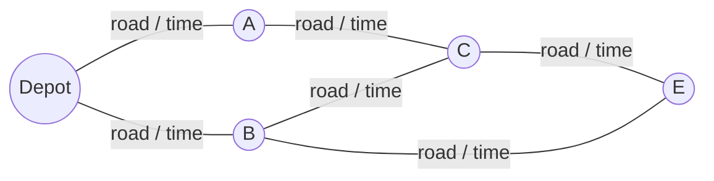

The graph is weighted using dynamic travel time.

Therefore, the shortest path is not necessarily the geographically shortest path.

---

# 38. Why QPSO Fits the Routing Problem

Vehicle routing is a combinatorial optimization problem with a large search space.

For `n` delivery stops, the number of possible visit orders grows factorially:

```text
n!
```

For example:

```text
5 stops  → 120 possible orders
10 stops → 3,628,800 possible orders
```

With multiple vehicles, capacities, congestion, and time windows, the search space becomes considerably larger.

QPSO provides a population-based metaheuristic search mechanism that can explore many candidate solutions without exhaustively enumerating every route.

---

# 39. Project Pipeline in One Diagram

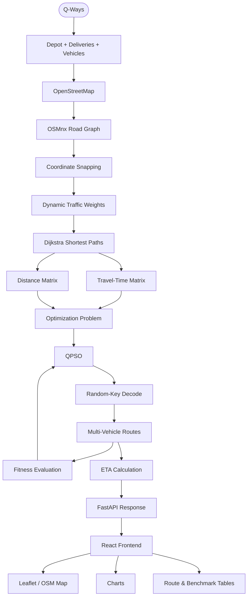

---

# 40. Team

| Member | Role |
|---|---|
| **Udit Raghuwnashi** | Team Leader, Database Manager & Frontend UI |
| **Aniruddha Sharma** | ML Lead & Frontend |
| **Aditi Dhakad** | Backend Pipelines |
| **Vanshika Jain** | Graph Analysis & Backend Integration |
| **Alafiya Naaz** | Research & PPT Work |
| **Aditiya Tiwari** | Research & PPT Work |

### Responsibility Breakdown

**Udit Raghuwnashi — Team Leader, Database Manager & Frontend UI**
- Overall technical coordination
- Frontend interface development
- API/data integration on the UI side
- Structured project data management

**Aniruddha Sharma — ML Lead & Frontend**
- QPSO optimization logic
- Optimization formulation
- Fitness and convergence logic
- Frontend optimization components

**Aditi Dhakad — Backend Pipelines**
- FastAPI service layer
- API endpoints
- Request/response pipeline
- Optimization service orchestration

**Vanshika Jain — Graph Analysis & Backend Integration**
- Road-network graph construction
- OSMnx / NetworkX processing
- Dijkstra-based routing matrices
- Traffic graph processing
- Graph/backend integration

**Alafiya Naaz & Aditiya Tiwari — Research & PPT Work**
- Problem research
- Technical documentation
- SIH presentation material
- System explanation and presentation preparation

---

# 41. Data Management Note

The current repository does **not** use a relational database such as PostgreSQL or MySQL.

The main data mechanisms currently implemented are:

```text
OpenStreetMap
      ↓
OSMnx
      ↓
NetworkX graph
      ↓
GraphML cache
      ↓
FastAPI in-memory graph state
      ↓
JSON API
      ↓
React frontend
```

The `city.graphml` file is used as the local road-network cache.

---

# 42. External Services and Data Sources

| Service / Source | Usage |
|---|---|
| OpenStreetMap | Road-network and map data |
| OSMnx | Download and process road network |
| OSRM | Road geometry for visual route rendering |
| Leaflet | Interactive map |
| FastAPI | Internal REST API |
| NetworkX | Graph processing and Dijkstra |

---

# 43. Security and API Configuration

The FastAPI application currently enables CORS for browser access:

```python
allow_origins=["*"]
```

This is suitable for the prototype's cross-origin frontend/backend communication.

The backend is intended to be run locally with Uvicorn for the project demonstration.

---

# 44. Project Technologies at a Glance

```text
                         Q-WAYS
                           │
        ┌──────────────────┴──────────────────┐
        │                                     │
    FRONTEND                              BACKEND
        │                                     │
   React + TS                              FastAPI
   Vite                                    Uvicorn
   Tailwind                                Pydantic
   Zustand                                  │
   Leaflet                                  │
   Recharts                                 │
   KaTeX                                    │
        │                            ┌───────┴────────┐
        │                            │                │
     UI / Map                    GRAPH             OPTIMIZER
                                   │                │
                                 OSMnx             QPSO
                               NetworkX          NumPy
                               Dijkstra        Fitness
                                  │                │
                                  └───────┬────────┘
                                          │
                                    Optimized Routes
                                          │
                                     React + Leaflet
```

---

# 45. Key Implementation Files

### QPSO

```text
QPSO_Backend/optimization/qpso.py
```

Contains the QPSO particle model, random-key encoding, route decoding, fitness evaluation, particle updates, and optimization loop.

### Fitness

```text
QPSO_Backend/optimization/fitness.py
```

Contains travel-time, distance, ETA, time-window, and route-cost calculations.

### Graph

```text
QPSO_Backend/graph/road_network.py
QPSO_Backend/graph/distance_matrix.py
QPSO_Backend/graph/traffic.py
```

Responsible for road-network loading, node snapping, traffic weighting, and matrix generation.

### Backend API

```text
QPSO_Backend/main.py
```

Connects the graph and optimization modules into REST endpoints.

### Frontend API Client

```text
QPSO_Frontend/src/api/client.ts
```

Connects the React application to the FastAPI backend.

### Map

```text
QPSO_Frontend/src/components/map/MapView.tsx
```

Renders road networks, stops, vehicle routes, and road geometry.

---

# 46. Complete Technology Flow

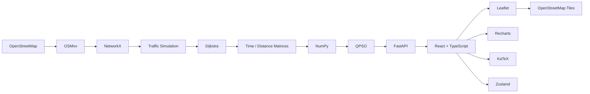

---

# 47. Repository Status

The repository contains an end-to-end prototype covering:

- Road-network acquisition
- Graph construction
- Coordinate snapping
- Simulated traffic
- Dynamic travel-time weighting
- Dijkstra routing
- Distance/time matrix generation
- Optimization problem modeling
- QPSO implementation
- Vehicle route decoding
- Capacity penalties
- Time-window penalties
- ETA calculation
- FastAPI endpoints
- React frontend
- Interactive Leaflet map
- Convergence visualization
- Benchmarking interfaces
- Mathematical formulation
- Deliverable mapping

Q-Ways therefore connects the complete pipeline:

```text
Geographic Data
      ↓
Road Graph
      ↓
Traffic-Aware Graph
      ↓
Shortest Paths
      ↓
Optimization Matrices
      ↓
QPSO
      ↓
Vehicle Routes
      ↓
ETA / Metrics
      ↓
API
      ↓
Interactive Visualization
```

---

## Q-Ways

**Quantum-Inspired Intelligent Traffic Route Optimization**

**Smart India Hackathon 2026 — SIH26137**
